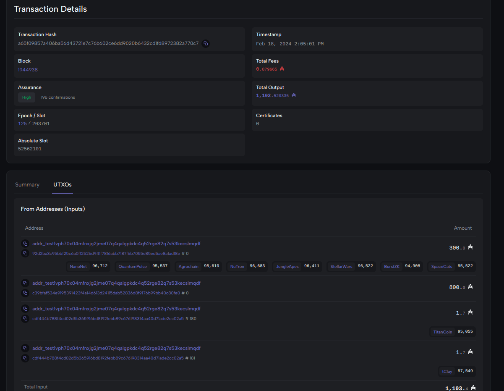

## 1. Project
    
**tps-cooker** : A tool to bring consolidate cardano transactions into a single transaction by taking advantage of Cardano's EUTXO model.

By team DCentral.

## 2. Project's Description

A self-service utility for creating batched transactions to distribute various tokens to multiple addresses with minimal transaction fees. Ideal for NFT drops, airdrops, etc. The project and file naming theme draw inspiration from Indian kitchens, where the pressure cooker plays a crucial role due to its time and energy efficiency. 😊

## 3. What problem you are trying to solve
Blockchain transactions involve network fees. Batched transactions reduce fees. Third party services may charge for doing batched transactions like NFT drops or other airdrops. This utility, using cardano-cli, enables self-service batching to minimize transaction fees and achieve higher effective TPS (or as the Cardano community likes to call - transactions per transaction).


## 4. Tech Stack used while building the project
Haskell: Parses configuration, data files, and creates batched transactions.
Shell scripts: Orchestrates various steps.
Cardano-cli and cardano-node: Used to submit the transaction to the blockchain.

- Supported OS env : Linux 

## 5. Project Demo Photos, Videos

### How to run

#### 1. Start your cardano-node
#### 2. Navigate inside folder `DCentral`
#### 3. Set properties

You need to set the following values in `/src/Properties.hs`

- `cardanoNetwork` : testnet or mainnet
- `storageAddress` : This is the address where your tokens to be sent are stored
- `txInList`: The tx in should contain tx-ins of all native tokens at the storage address and tx-in for sufficient ADA
- `assetInfo` : This is the comma separated list of policy id, asset name and total quantity at the storage address.

Place the signing key for the address holding your tokens under `/runtime` directory

#### 4. Build the haskell executable
```bash
cabal build tps-cooker
```


```
Central > cabal build tps-cooker
Resolving dependencies...
Build profile: -w ghc-8.10.7 -O1
In order, the following will be built (use -v for more details):
- DCentral-tps-cooker-1.0.0.0 (exe:tps-cooker) (first run)
  Configuring executable 'tps-cooker' for DCentral-tps-cooker-1.0.0.0..
  Preprocessing executable 'tps-cooker' for DCentral-tps-cooker-1.0.0.0..
  Building executable 'tps-cooker' for DCentral-tps-cooker-1.0.0.0..
  [1 of 3] Compiling Properties       ( src/Properties.hs, /home/hdd/IdeaProjects/ccodex23/DCentral/dist-newstyle/build/x86_64-linux/ghc-8.10.7/DCentral-tps-cooker-1.0.0.0/x/tps-cooker/build/tps-cooker/tps-cooker-tmp/Properties.o )
  [2 of 3] Compiling Types            ( src/Types.hs, /home/hdd/IdeaProjects/ccodex23/DCentral/dist-newstyle/build/x86_64-linux/ghc-8.10.7/DCentral-tps-cooker-1.0.0.0/x/tps-cooker/build/tps-cooker/tps-cooker-tmp/Types.o )
  [3 of 3] Compiling TxChef           ( src/TxChef.hs, /home/hdd/IdeaProjects/ccodex23/DCentral/dist-newstyle/build/x86_64-linux/ghc-8.10.7/DCentral-tps-cooker-1.0.0.0/x/tps-cooker/build/tps-cooker/tps-cooker-tmp/TxChef.o )
  Linking /home/hdd/IdeaProjects/ccodex23/DCentral/dist-newstyle/build/x86_64-linux/ghc-8.10.7/DCentral-tps-cooker-1.0.0.0/x/tps-cooker/build/tps-cooker/tps-cooker ...
```


#### 5. Place your token distribution csv in `resources` directory and run the executable 

 The distribution data is tabular data named `recipe.csv` with columns `slno,address,assetId,assetName,amount` to create batched transactions.
Take a look at the sample file `recipe-sample.csv` to see the format of the file.

#### 6. Run the utility. Execute the script
```bash
./prepare-and-submit-tx.sh
```

```
DCentral > ./prepare-and-submit-tx.sh 
Up to date
Estimated transaction fee: Lovelace 786913
Transaction successfully submitted.
```
Demo tx run on preprod environment:
   - https://preprod.cardanoscan.io/transaction/a65f09857a406ba56d43721e7c76b602ce6dd9020b6432cd1fd8972382a770c7

184 transactions to each to a different address and involving 10 different Cardano native tokens of carious amounts was batched for a network fee of just 0.878 ADA. Individual transactions would have cost more than 30 ADA in network fee.
This shows a more than 97% reduction in network fee due to batching. 



Other sample tx: 
   - https://preprod.cardanoscan.io/transaction/c39bfaf534e9195391423f4a14d613d24115dab52836d8f9176b99bb40c80fe0
   - https://preprod.cardanoscan.io/transaction/92d2ba3c95bbf25c6a0f12526d941f7816abb7187f6b7055e85ed5ae8a1ad18e

## 6. If your project is deployed, then include the Live Project Link
    It is a utility

## 7. PPT link 
- https://docs.google.com/presentation/d/11FPmEkHS2mIMwyH5Bpdrg-CVKhvtpj4WFUhZl2PxcEw/edit?usp=sharing

  _(attached file: DCentral-CardanoCodex23.pdf)_

## 8. Team Contact
- **Reshma Mohan**
   - GitHub: https://github.com/resgsh
   - Twitter: [@reshmhn](https://twitter.com/reshmhn)
   - Email: [resh.mhn@gmail.com](mailto:resh.mhn@gmail.com)

-----------------------------------------

-----------------------------------------

### Troubleshoot
In case you try to batch transactions more that what is supported by the network you will see the following error message. It means you need to reduce the number of transactions in your recipe.csv to fit into a single batched tx.

```
Command failed: transaction submit  Error: Error while submitting tx: ShelleyTxValidationError ShelleyBasedEraBabbage (ApplyTxError [UtxowFailure (UtxoFailure (AlonzoInBabbageUtxoPredFailure (MaxTxSizeUTxO 83413 16384)))])
```
